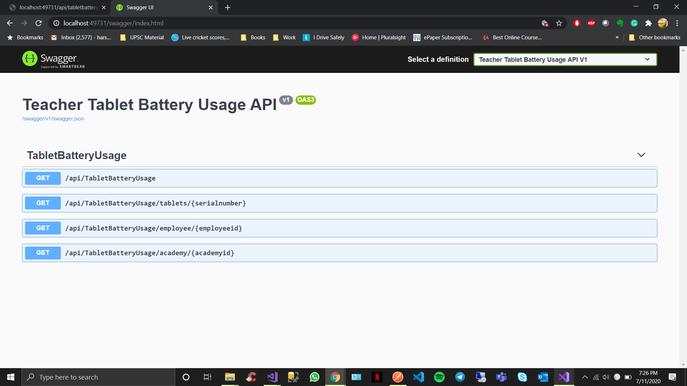

# BridgeInternationalCodingTest

#### Tools Used: Visual Studio 2019, Postman.
#### Libraries and frameworks used: .Net Core 3.1, xUnit framework, Newtonsoft.Json, Swashbuckel.AspNetCore. 
#### Assumptions: 
Assumed each tablet is assigned to a single employee and academy.
#### Executing instructions: 
Please copy file path of battery.json from local system to TabletDataFromJsonFile.cs constructor. 
### Get All Tablets Data
Get the details of the currently Authenticated User along with basic subscription information.
#### URL : /api/tabletbatteryusage
#### Method : GET
#### Success Response
#### Code : 200 OK
#### Content examples
Json data is captured from given file and calculated battery usage percentage for each device.
```json
[
    {
        "serialNumber": "1805C67HD02259",
        "batteryPercentage": 15.32,
        "batteryReplacementNeeded": "BatteryIsGood"
    },
    {
        "serialNumber": "1805C67HD02332",
        "batteryPercentage": 26.75,
        "batteryReplacementNeeded": "BatteryIsGood"
    }
 ]
```
### Get Tablets Data By Device
Get the details of the currently Authenticated User along with basic subscription information.
#### URL : /api/tabletbatteryusage/tablets/:pk
#### Method : GET
#### URL : [pk = string]  Serialnumber as string
#### Success Response
#### Code : 200 OK
#### Content examples
calculated battery usage percentage for each device after filtering by serial number.
```json
[
    {
        "serialNumber": "1805C67HD02317",
        "batteryPercentage": 29.48,
        "batteryReplacementNeeded": "BatteryIsGood"
    }
]
```
### Get Tablets Data By Employee
Get the details of the currently Authenticated User along with basic subscription information.
#### URL : /api/tabletbatteryusage/employee/:pk
#### Method : GET
#### URL : [pk = string] employeeId as string 
#### Success Response
#### Code : 200 OK
#### Content examples
calculated battery usage percentage for each device after filtering by employeeId.

```json
[
    {
        "serialNumber": "1805C67HD02332",
        "batteryPercentage": 173.1,
        "batteryReplacementNeeded": "ReplaceBattery"
    },
    {
        "serialNumber": "NGTT-0944",
        "batteryPercentage": 31.79,
        "batteryReplacementNeeded": "ReplaceBattery"
    }
]
```
### Get Tablets Data By Academy
Get the details of the currently Authenticated User along with basic subscription information.
#### URL : /api/tabletbatteryusage/academy/:pk
#### Method : GET
#### URL : [pk = int] academy as int 
#### Success Response
#### Code : 200 OK
#### Content examples
calculated battery usage percentage for each device after filtering by academyid.
```json
[
    {
        "serialNumber": "1805C67HD02259",
        "batteryPercentage": 15.32,
        "batteryReplacementNeeded": "BatteryIsGood"
    },
    {
        "serialNumber": "1805C67HD02332",
        "batteryPercentage": 26.75,
        "batteryReplacementNeeded": "BatteryIsGood"
    },
    {
        "serialNumber": "1805C67HD02009",
        "batteryPercentage": 17.04,
        "batteryReplacementNeeded": "BatteryIsGood"
    }
]
```
### Please go to following link for Swagger API documentation. http://localhost:49731/swagger/index.html 

### Thought process while developing API.
Created different projects for each module of the API for easy maintainability. Models are in TabletBatteryUsage.Core project, models are used for serailizing and deserializing json data.Implemented TabletBatteryUsage.Data project for Data layer of application. Where I have created interface file which can be used for multiple data sources and which is very useful while scalling the API. As this API uses json file as datasource, created implementation file for same interface file. Created TabletBatteryUsage.API which as end point for GetBatteryData, where I have used dependancy injection to reduce tight coupling. Crated TabletBatteryUsage.Tests for unit testing Web API, where I have implemented two test classes which give maximum code coverage of given application. 
 
